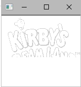

# gameboy-emu
Not yet finished Gameboy emulator written in C++. With help from codeslinger.co.uk and r/EmuDev. Main documentation used for the Gameboy system are the [pandocs](http://bgb.bircd.org/pandocs.htm) and [the official Gameboy programming manual](https://archive.org/details/GameBoyProgManVer1.1).

